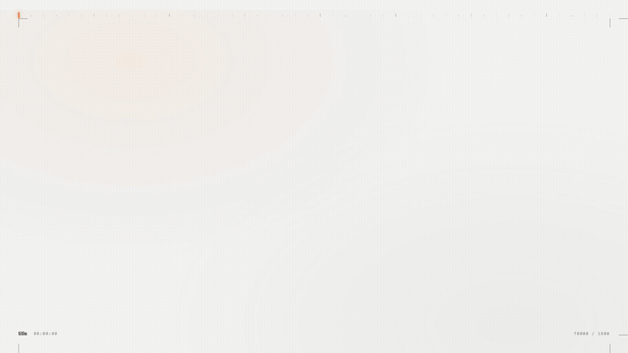

<div align="center">

# 🎬 Zomotion

### *The Cinematic Programmatic Motion Graphics Engine*

[](LICENSE)
[](https://react.dev/)
[](https://www.typescriptlang.org/)
[]()
[]()
[]()

<br />

---

### 📽️ Watch the Official Zomotion Reel (60s • 1080p • 30fps)

<a href="https://github.com/xAmirHamza77/zomotion/raw/main/out/zomotion-reel.mp4">
  
</a>

<p align="center">
  ▶️ <b><a href="out/zomotion-reel.mp4">Click to Download or Watch Full-Resolution MP4 (10.5 MB)</a></b> • <i>Features 2.5D PageCam, closed-form physics, and synchronized sound design.</i>
</p>

---

</div>

<br />

## 🌟 Why Zomotion?

Standard programmatic code-generated videos usually suffer from three telltale defects:
1. **Robotic Linear Motion**: Elements slide and scale with uniform velocity without organic acceleration, inertia, or recoil.
2. **Chromium Downsample Blur**: Applying standard 3D GPU transforms (`transform: scale(zoom)`) causes Chromium to rasterize UI elements at standard layout bounds and GPU-upscale them, blurring typography and fine UI borders.
3. **Cheesy Game Audio**: Soundtracks populated with cartoon synthesizer bloops and notification pings rather than tangible acoustic textures.

**Zomotion** solves all three flaws. It provides a production-tested motion design system for React developers and AI agents to generate cinema-grade product promos, kinetic typography, dashboard flythroughs, and viral vertical shorts entirely from code.

<br />

## ✨ Core Pillars

```
                     ┌─────────────────────────────────────────┐
                     │          ZOMOTION ENGINE CORE           │
                     └────────────────────┬────────────────────┘
                                          │
         ┌────────────────────────┬───────┴────────┬────────────────────────┐
         ▼                        ▼                ▼                        ▼
 ┌───────────────┐        ┌───────────────┐ ┌───────────────┐       ┌───────────────┐
 │  2.5D PageCam │        │  Closed-Form  │ │  157 Recipes  │       │   16-Family   │
 │ Layout-Scale  │        │    Physics    │ │  10 Families  │       │ Sound Design  │
 │  Pin-Sharp UI │        │ Mulberry32 PR │ │ Kinetic Typo  │       │  AAC Priming  │
 └───────────────┘        └───────────────┘ └───────────────┘       └───────────────┘
```

### 1. 🎥 2.5D Perspective Camera (`PageCam`)
Solves the Chromium 3D rasterization bug by multiplying magnification via the CSS `zoom` property while locking coordinate translations to the focal target `(cx, cy)`:
$$T_x = \frac{960}{\text{zoom}} - cx, \quad T_y = \frac{540}{\text{zoom}} - cy$$
Typography, SVG icons, and high-resolution textures stay razor-sharp at 200%+ magnification angles.

### 2. ⚡ 157 Verified Motion Recipes Across 10 Families
Tested visual dynamics categorized into reusable formulas:
- **`typography`**: `lead-word-zoom-assemble`, `split-flap-title`, `marker-underline-title`
- **`ui-entrance`**: `deck-deal-flyin`, `spotlight-hero-card`, `cascade-drop`
- **`camera`**: `orbit-pile`, `snap-zoom-focus`, `dutch-angle-glide`
- **`data`**: `digit-roll` (mechanical odometer), `radial-ring-progress`, `metric-race-bar`
- **`effects`**: `spotlight-beam`, `glint-sheen` (strictly masked to border radius)
- **`transition`**: `flash-cut`, `whip-pan`, `push-through-portal`
- **`rhythm`**: `beat-slam` (strictly budgeted $\le 3$ full-screen slams per video), `micro-freeze`
- **`opening & outro`**: `hero-macro-opening`, `showcase-assembly`

### 3. 📐 Closed-Form Physics & Multi-Worker Determinism
- **Harmonic Oscillators**: `dampedSettle(t, freq, damping)` provides physical recoil on collisions and landings ($e^{-\gamma t}\sin(2\pi \omega t)$).
- **Central-Difference Velocity**: `velocityAt(posAt, frame)` extracts real-time vectors for directional motion blur and squash/stretch.
- **Mulberry32 PRNG**: 100% deterministic 32-bit pseudo-randomness eliminating frame tearing across multi-threaded render workers.

### 4. 🔊 16-Family Acoustic Hierarchy & AAC Priming Compensation
- **Authentic Foley**: Mechanical switches, photographic shutters, sub-bass impacts, and paper textures.
- **Latency Compensation**: Automatic $-1.28\text{f}$ priming offset compensation for Chromium AAC audio encoding:
$$\text{from} = \max\left(0, \text{round}(\text{targetVisualFrame} - \Delta_{\text{priming}} - \Delta_{\text{attack}})\right)$$
- **Stepped Volume Decay**: Prevents auditory fatigue during cascading element entrances ($0.40 \rightarrow 0.35 \rightarrow 0.30$).

<br />

## 📁 Compositions Included

This repository comes pre-loaded with 5 production compositions:

| Composition ID | Aspect Ratio | Resolution | Duration | Description |
| :--- | :--- | :--- | :--- | :--- |
| **`ZomotionReel`** | `16:9` | 1920×1080 | 60 sec (1800f) | Flagship 5-act showcase reel demonstrating the full engine capabilities. |
| **`ZomotionExplainer`** | `16:9` | 1920×1080 | 60 sec (1800f) | Full product explainer video breaking down Zomotion architecture. |
| **`Gemini4ProTeaser`** | `9:16` | 1080×1920 | 10 sec (300f) | Rapid-fire vertical teaser optimized for Shorts / TikTok. |
| **`Gemini4ProFull`** | `9:16` | 1080×1920 | 30 sec (900f) | Vertical promo with terminal benchmarks and kinetic captions. |
| **`TrendingAIShort`** | `9:16` | 1080×1920 | 30 sec (900f) | Automated data-driven short format with synchronized voiceover. |

<br />

## 🚀 Quickstart

### Prerequisites
- Node.js 18+
- npm or pnpm

### Installation
```bash
# Clone the repository
git clone https://github.com/xAmirHamza77/zomotion.git
cd zomotion

# Install dependencies
npm install
```

### Development Studio
Launch the real-time interactive timeline player:
```bash
npm run dev
```
Open [http://localhost:3000](http://localhost:3000) to scrub frames, edit properties, and inspect animations with instant hot reload.

### Production Rendering
```bash
# Render the flagship showcase reel (outputs to out/zomotion-reel.mp4)
npm run render

# Render the 1-minute explainer
npm run render:explainer

# Inspect a single still frame at an exact inflection point
npm run still -- --frame=150 out/still-f150.png
```

<br />

## 🧱 Repository Structure

```
zomotion/
├── .agents/skills/zomotion/      # Antigravity agent skill definition & recipes
│   ├── SKILL.md                  # Complete agent prompt & execution rules
│   ├── references/               # Deep-dive engineering documentation
│   │   ├── aesthetic-checklist.md
│   │   ├── beat-sync-methodology.md
│   │   ├── camera-25d.md
│   │   ├── physics-motion-math.md
│   │   ├── shot-recipes.md
│   │   └── sound-design-matrix.md
│   └── templates/                # Reusable primitives
├── out/
│   ├── zomotion-preview.gif      # Lightweight README preview
│   └── zomotion-reel.mp4         # Rendered 1080p showcase video (10.5 MB)
├── public/
│   ├── audio/                    # 16-family Foley, SFX, and BGM library
│   └── textures/                 # 2x resolution UI screenshot assets
├── src/
│   ├── reel/                     # 5 acts of the flagship ZomotionReel
│   ├── vertical/                 # 9:16 vertical short-form compositions
│   ├── video/                    # 60s ZomotionExplainer scene compositions
│   ├── zomotion/                 # Core engine primitives (PageCam, HeroCard, etc.)
│   ├── Root.tsx                  # Master composition registration
│   └── index.ts                  # Entry point
├── package.json
└── tsconfig.json
```

<br />

## 📋 The 5 Golden Aesthetic Laws

Before rendering or presenting any motion graphics, Zomotion compositions are audited against these battle-tested standards:

1. **R1 (Hold for Breathing Space)**: Brand logos and wordmarks must hold stationary for $\ge 1.0\text{s}$ (30 frames); cards hold $\ge 0.5\text{s}$.
2. **R4 (Camera Slam Budget)**: Full-screen scale punches, camera slams, and strobe cuts are limited to **$\le 3$ occurrences per entire video**.
3. **Q2 (Pin-Sharp Text in 3D)**: Always use layout-scale CSS zoom via `PageCam` math rather than GPU-upscaled `transform: scale()`.
4. **Q4 (Controlled Specular Sheen)**: Maximum 1 sheen sweep per shot on the protagonist element, strictly masked inside `borderRadius`.
5. **S1 & S5 (Acoustic Authenticity)**: Real physical textures only (no arcade bloops); audio cues apply $-1.28\text{f}$ priming latency compensation.

<br />

## 🤖 Antigravity Skill Integration

Zomotion is also equipped as an autonomous AI agent skill. When using the Antigravity assistant, prompt the agent with:
> *"Create a 30-second product promo video using the zomotion skill with PageCam perspective and beat-synced sound design."*

The agent reads `.agents/skills/zomotion/SKILL.md` to scaffold scenes, calculate frame timing, and render pixel-perfect compositions automatically.

<br />

## 📄 License

This project is licensed under the [MIT License](LICENSE).
